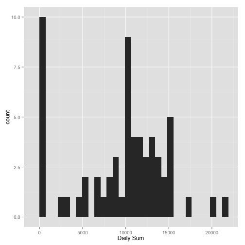
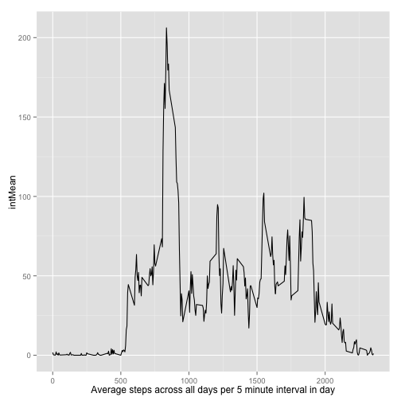
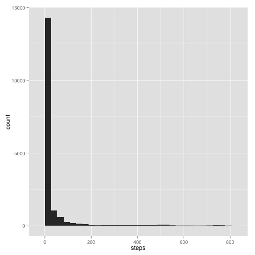
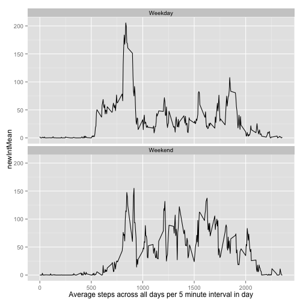

### Loading and preprocessing the data
>Show any code that is needed to
>
> * Load the data (i.e. read.csv())
> * Process/transform the data (if necessary) into a format suitable for your analysis

Here we test if the data has already been unzipped, and if not unzip it. The date column is converted to class `Date`.


```r
if (!file.exists("activity.csv"))
    unzip("activity.zip")
activity <- read.csv("activity.csv", header=TRUE)
activity$date <- as.Date(activity$date)
```

## What is mean total number of steps taken per day?
> For this part of the assignment, you can ignore the missing values in the dataset.
>
> * Make a histogram of the total number of steps taken each day


```r
library(ggplot2)
options(scipen=2)
# This option allowed a 5 digit number to be printed without converting to scientific
# notation for inline text below, which by default knitter converts at 4 digits.
# Found docs on this at: http://yihui.name/knitr/demo/output/
library(plyr)
totalStepsEachDay <- ddply(activity, "date", summarize, 
                    dailySum = sum(steps, na.rm = TRUE),
                    dailyMean = mean(steps, na.rm=TRUE),
                    dailyMedian = median(steps, na.rm=TRUE))

# hist(totalStepsEachDay$dailySum, breaks=8, xlab="Daily Sums divided into 8 buckets")
# Replaced hist with ggplot for consistency with later charting
# Also geom_histogram prints a warning that it uses default binwidth = range/30
# I set the binwidth manually to that amount so I don't get the warning
ggplot(totalStepsEachDay, aes(x=dailySum)) + geom_histogram(
    binwidth=(range(totalStepsEachDay$dailySum)[2])/30) + xlab("Daily Sum")
```

 

> * Calculate and report the mean and median total number of steps taken per day


```r
# Rounding to whole number as data does not have concept of fractional steps
meanTotal <- as.integer(mean(totalStepsEachDay$dailySum, na.rm=TRUE))
medianTotal <- round(as.integer(median(totalStepsEachDay$dailySum, na.rm=TRUE)), digits = 0)
# I will use these values inline below:
```


The mean of the total steps each day is **9354** and the median is **10395**.


## What is the average daily activity pattern?
> Make a time series plot (i.e. type = "l") of the 5-minute interval (x-axis) and the average > number of steps taken, averaged across all days (y-axis)


```r
library(ggplot2)
activityPattern <- ddply(activity, "interval", summarize, 
                         intMean = mean(steps, na.rm = TRUE))
ggplot(activityPattern, aes(x=interval, y=intMean)) + geom_line() +  xlab("Average steps across all days per 5 minute interval in day")
```

 

> Which 5-minute interval, on average across all the days in the dataset, contains the
> maximum number of steps?


```r
# Help for function max() lead me to which.max()
maxPatternInterval <- which.max(activityPattern$intMean)
maxInterval <- activityPattern$interval[maxPatternInterval]
maxOfMeanSteps <- round(activityPattern$intMean[maxPatternInterval], digits=0)
```

The 5 minute interval with the most steps across all days is **interval 835** with the **value of 206** steps.


## Imputing missing values

> Note that there are a number of days/intervals where there are missing values (coded as
> NA). The presence of missing days may introduce bias into some calculations or summaries 
> of the data.
>
> Calculate and report the total number of missing values in the dataset (i.e. the total 
> number of rows with NAs)
>

```r
naPosition <- is.na(activity$steps)
totalNA <- sum(naPosition)
```

The total number of missing values in the dataset is **2304**.

> Devise a strategy for filling in all of the missing values in the dataset. The strategy
> does not need to be sophisticated. For example, you could use the mean/median for that day,
> or the mean for that 5-minute interval, etc.
>

Our non-sophisticated strategy will be to use the median (across all days) for the 
interval with a NA value. This provides average values that are not distorted by outlyers.

> Create a new dataset that is equal to the original dataset but with the missing data filled
> in.
>


```r
# First we set up the new dataset by cloning the original
newActivity <- activity
activityPatternMedian <- ddply(newActivity, "interval", summarize, 
                         intMedian = median(steps, na.rm = TRUE))
# This finds steps with NA values, looks up the associated interval,
# then lookups up the median for that interval, and finally replaces the
# NA value with the median for that interval.
for (i in seq_along(newActivity$steps)){
    if(is.na(newActivity$steps[i])){
        currentNaInterval <- newActivity$interval[i]
        currentIntervalMedian <- activityPatternMedian$intMedian[
            activityPatternMedian$interval==currentNaInterval]
        newActivity$steps[i] <- currentIntervalMedian
    }
}    
```

> Make a histogram of the total number of steps taken each day and Calculate and report the 
> mean and median total number of steps taken per day. 


```r
# See previous note about manually setting binwidth to default to avoid warning message.
ggplot(newActivity, aes(x=steps)
       ) + geom_histogram(binwidth=(range(newActivity$steps)[2])/30)
```

 

```r
# Rounding to whole number as data does not have concept of fractional steps
totalStepsEachDayWithoutNA <- ddply(newActivity, "date", summarize, 
                    dailySumWithoutNA = sum(steps),
                    dailyMeanWithoutNA = mean(steps),
                    dailyMedianWithoutNA = median(steps))
meanTotalWithoutNA <- as.integer(mean(totalStepsEachDayWithoutNA$dailySumWithoutNA))
medianTotalWithoutNA <- round(as.integer(
    median(totalStepsEachDayWithoutNA$dailySumWithoutNA)), digits = 0)
# I will use these values inline below and compare with previously generated values:
```


By replacing NA values with the median across all days for that interval, the new mean of the total steps each day is **9503** and the new median is **10395**.

> Do these values differ from the estimates from the first part of the assignment? 

The values previously generated by removing NA's have the mean of the total steps each day as **9354** and the median as **10395**.

> What is the impact of imputing missing data on the estimates of the total daily 
> number of steps?

The impact of replacing NA values with the median for the segment increases the total
mean steps per day while leaving the total median steps per day the same. 

This is consistant with expectations, as median is the middle position of all values while mean is the sum of values divided by the number of values. 

## Are there differences in activity patterns between weekdays and weekends?
> For this part the weekdays() function may be of some help here. Use the dataset with the 
> filled-in missing values for this part.
>
> Create a new factor variable in the dataset with two levels – “weekday” and “weekend” 
> indicating whether a given date is a weekday or weekend day.


```r
newActivity$day <- weekdays(newActivity$date)
newActivity$weekday <- ifelse(newActivity$day %in% c("Saturday", "Sunday"), 
                              "Weekend", "Weekday")
newActivity$weekday <- as.factor(newActivity$weekday)
```

>
> Make a panel plot containing a time series plot (i.e. type = "l") of the 5-minute interval 
> (x-axis) and the average number of steps taken, averaged across all weekday days or weekend
> days (y-axis). See the README file in the GitHub repository to see an example of what this 
> plot should look like using simulated data.


```r
newActivityPattern <- ddply(newActivity, .(interval, weekday),
                            summarize, newIntMean = mean(steps))
ggplot(newActivityPattern, aes(x=interval, y=newIntMean)) + geom_line() +  xlab("Average steps across all days per 5 minute interval in day") + facet_wrap(~ weekday, ncol=1)
```

 

